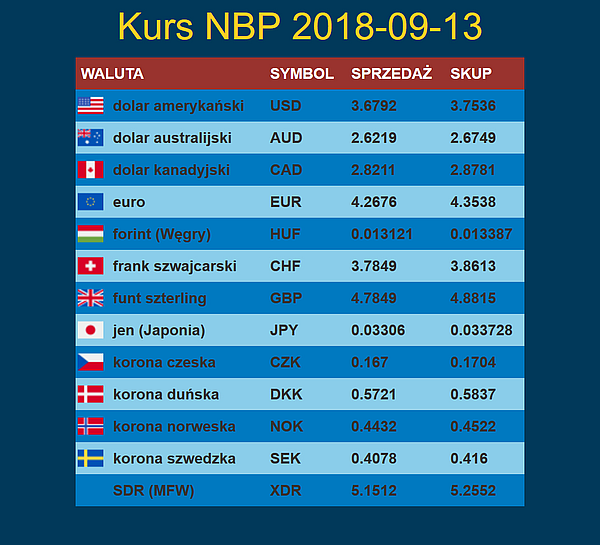

# Progam pobiera dane z API NBP (http://api.nbp.pl/) i wyświetla w formie tabelki.
## General info
 Dane wyswietlane w formie tabelki z dołączonymi flagami poszczególnych państw.
## Screenshot

## Technologies
 * JAVASCRIPT
 * AJAX
 * SASS
 * Gulp
 * npm
## After downloading and unpacking the project, open the command line in the created directory and enter the command 
 * npm install
   
## When the dependency dependence process finishes, we start the project with the command
 * gulp
   
## Contact
 Created by [@pablop76](http://www.web-service.com.pl/) - feel free to contact me!